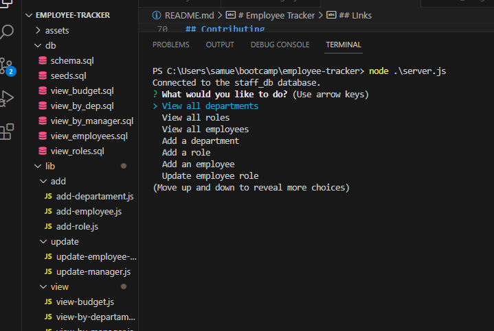
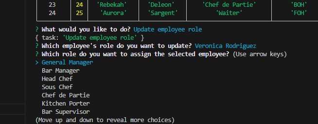
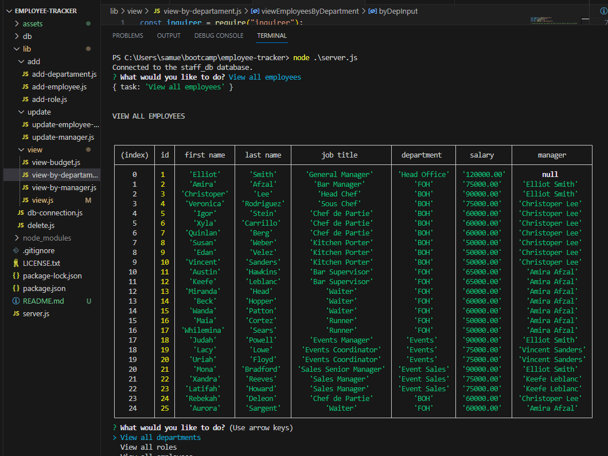
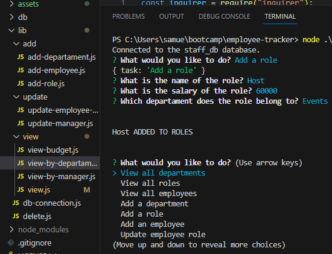

# Employee Tracker

[](https://opensource.org/licenses/MIT)

## Description

Employee Tracker was created for business owners to view and manage the departments, roles, and employees in a company.

## Table of Contents

- [Installation](#installation)
- [Usage](#usage)
- [License](#license)
- [Contributing](#contributing)
- [Questions](#questions)
- [Credits](#credits)
- [Links](#links)

## Installation

1. Clone the repo

   ```sh
   git clone https://github.com/voi-jankowski/employee-tracker.git
   ```

2. Install NPM packages

   ```sh
   npm install
   ```

<p align="right">(<a href="#readme-top">back to top</a>)</p>

## Usage

From the location of server.js file in your terminal start with the below command:

```sh
node server.js
```

You will be presented with a list of options for the tasks you might want to perform. Use the arrows to hightlight desired option and press `Enter` to make your selection.



Depending on the chosen option you might be asked some additional questions to set the parameters for your task. If it's the list of options, select one like in the initial prompt. If you are asked for a name of employee, department or role, type out the requested name. If you leave those blank you will be redirected to the start to provide that input to make sure all the input is provided.

When choosing or updateing the manager for an employee you will be presented with the list of all the employees to assign as managers with the extra option of `none` if you are saving a General Manager or any possible employee that doesn't report to a manager. When you later view them on the list of employees, you will see NULL in their manager field.



When you select one of the `view` tasks, you will be presented with the table with the results of your search.



When you select one of the `add`, `update` or `delete` tasks and provided your requests for changes, you will be alerted with the log confirming the completion of that task.



After the completion of each task you will be redirected back to the first prompt and you can select another task to perform.
At any time you can quit the app by pressing `CTRL` and `C` keys.

<p align="right">(<a href="#readme-top">back to top</a>)</p>

## License

Distributed under the [MIT License](https://opensource.org/licenses/MIT). See LICENSE.txt for more information.

<p align="right">(<a href="#readme-top">back to top</a>)</p>

## Contributing

If you have a suggestion that would make this better, please fork the repo and create a pull request. You can also simply open an issue with the tag "enhancement".
Don't forget to give the project a star!

1. Fork the Project
2. Create your Feature Branch (`git checkout -b feature/YourFeature`)
3. Commit your Changes (`git commit -m 'Add Your Feature'`)
4. Push to the Branch (`git push origin feature/YourFeature`)
5. Open a Pull Request

<p align="right">(<a href="#readme-top">back to top</a>)</p>

## Questions

If you have any questions about the project please contact me through [my Github](https://github.com/voi-jankowski) or email me at [voi.jankowski@gmail.com](mailto:voi.jankowski@gmail.com).

<p align="right">(<a href="#readme-top">back to top</a>)</p>

## Credits

The method to run sql queries from separqte sql file sourced from [John Kolo](https://medium.com/@johnkolo/how-to-run-multiple-sql-queries-directly-from-an-sql-file-in-node-js-part-1-dce1e6dd2def)

<p align="right">(<a href="#readme-top">back to top</a>)</p>

## LInks

The location of the project [on GitHub](https://github.com/voi-jankowski/employee-tracker).

The walkthrough video can be accessed on [here](https://drive.google.com/file/d/15-OeCr41gL0kB4s6pmHtnzjDfuzGc28C/view).

<p align="right">(<a href="#readme-top">back to top</a>)</p>
